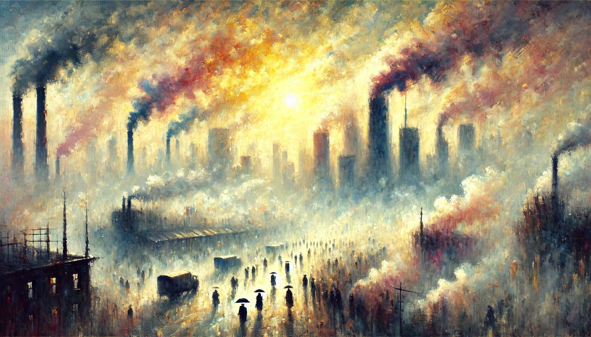

# AQI Hub

[](https://github.com/caiyunapp/aqi-hub/actions/workflows/test.yml)
[](https://pypi.org/project/aqi-hub/)
[](https://crates.io/crates/aqi-hub)
[](https://pypi.org/project/aqi-hub/)
[](https://github.com/caiyunapp/aqi-hub/blob/main/LICENSE)
[](https://caiyunapp.github.io/aqi-hub/)



AQI 计算，以及分指数计算。

**自 v1.0.0 起**：核心由 Rust 实现，Python 通过 PyO3 绑定调用；同时提供 Rust crate 可发布至 [crates.io](https://crates.io/crates/aqi-hub)。

**文档（使用方法）**：[https://caiyunapp.github.io/aqi-hub/](https://caiyunapp.github.io/aqi-hub/)  
**PyPI 项目页**：[https://pypi.org/project/aqi-hub/](https://pypi.org/project/aqi-hub/)  
**crates.io**：[https://crates.io/crates/aqi-hub](https://crates.io/crates/aqi-hub)  
本地预览文档：`make docs-serve`（需先 `uv sync --group dev`）  

## Contents

- [AQI Hub](#aqi-hub)
  - [Contents](#contents)
  - [计算方法](#计算方法)
    - [AQI (CN)](#aqi-cn)
    - [AQI (USA)](#aqi-usa)
  - [Rust 使用方法](#rust-使用方法)
    - [安装](#rust-安装)
    - [中国 AQI](#rust-中国-aqi)
    - [美国 AQI](#rust-美国-aqi)
  - [Python 使用方法](#python-使用方法)
    - [安装](#python-安装)
    - [中国 AQI 计算](#中国-aqi-计算)
    - [美国 AQI 计算](#美国-aqi-计算)
    - [返回值说明](#返回值说明)
    - [支持的污染物](#支持的污染物)
  - [参考文献](#参考文献)
  - [发布 (Publish)](#发布-publish)

## 计算方法

### AQI (CN)

计算方法参照中华人民共和国生态环境部标准 **GB 3095-2026 环境空气质量标准** 与 **HJ 633-2026 环境空气质量指数（AQI）技术规定（试行）**。  
**自 v0.3.0 起**采用 2026 版标准；v0.3.0 之前版本采用 2012 版标准。

本库实现与 2026 版一致，主要约定包括：

- **PM2.5**：良与轻度污染界限为 60 μg/m³（原 75）
- **PM10**：良与轻度污染界限为 120 μg/m³（原 150）
- **SO2 1 小时**：浓度超过 800 μg/m³ 时，IAQI 按 200 计（不再视为无效）
- **O3 8 小时**：浓度超过 800 μg/m³ 时，IAQI 按 300 计（不再视为无效）
- **新标准**：去掉了超标污染物的相关内容（仅保留首要污染物）

#### AQI 等级说明

| AQI 范围   | 指数级别 | 类别     | 颜色   |
| ---------- | -------- | -------- | ------ |
| 0 至 50    | 一级     | 优       | 绿色   |
| 51 至 100  | 二级     | 良       | 黄色   |
| 101 至 150 | 三级     | 轻度污染 | 橙色   |
| 151 至 200 | 四级     | 中度污染 | 红色   |
| 201 至 300 | 五级     | 重度污染 | 紫色   |
| 301+       | 六级     | 严重污染 | 褐红色 |

#### AQI 颜色标准（中国）

| RGB 颜色                                                          | R   | G   | B   | RGB HEX | CMYK 颜色                                                                   | C   | M   | Y   | K   | CMYK HEX |
| ----------------------------------------------------------------- | --- | --- | --- | ------- | --------------------------------------------------------------------------- | --- | --- | --- | --- | -------- |
|       | 0   | 228 | 0   | #00E400 |         | 40  | 0   | 100 | 0   | #99FF00  |
|     | 255 | 255 | 0   | #FFFF00 |          | 0   | 0   | 100 | 0   | #FFFF00  |
|     | 255 | 126 | 0   | #FF7E00 |         | 0   | 52  | 100 | 0   | #FF7A00  |
|       | 255 | 0   | 0   | #FF0000 |        | 0   | 100 | 100 | 0   | #FF0000  |
|      | 153 | 0   | 76  | #99004C |       | 10  | 100 | 40  | 30  | #A0006B  |
|  | 126 | 0   | 35  | #7E0023 |  | 30  | 100 | 100 | 30  | #7C0000  |

### AQI (USA)

计算方法参考 US EPA: [Technical Assistance Document for the Reporting of Daily Air Quality – the Air Quality Index (AQI)](https://document.airnow.gov/technical-assistance-document-for-the-reporting-of-daily-air-quailty.pdf)

#### AQI Range

| AQI Range  | Descriptor                     | Color  |
| ---------- | ------------------------------ | ------ |
| 0 to 50    | Good                           | Green  |
| 51 to 100  | Moderate                       | Yellow |
| 101 to 150 | Unhealthy for Sensitive Groups | Orange |
| 151 to 200 | Unhealthy                      | Red    |
| 201 to 300 | Very Unhealthy                 | Purple |
| 301+       | Hazardous                      | Maroon |

#### AQI Color

| RGB Color                                                           | R   | G   | B   | RGB HEX | CMYK Color                                                                  | C   | M   | Y   | K   | CMYK HEX |
| ------------------------------------------------------------------- | --- | --- | --- | ------- | --------------------------------------------------------------------------- | --- | --- | --- | --- | -------- |
|       | 0   | 228 | 0   | #00E400 |       | 40  | 0   | 100 | 0   | #99FF00  |
|   | 255 | 255 | 0   | #FFFF00 |      | 0   | 0   | 100 | 0   | #FFFF00  |
|   | 255 | 126 | 0   | #FF7E00 |     | 0   | 52  | 100 | 0   | #FF7A00  |
|           | 255 | 0   | 0   | #FF0000 |          | 0   | 100 | 100 | 0   | #FF0000  |
|  | 143 | 63  | 151 | #8F3F97 |      | 5   | 58  | 0   | 41  | #8F3F96  |
|    | 126 | 0   | 35  | #7E0023 |  | 30  | 100 | 100 | 30  | #7D0000  |

## Rust 使用方法

本库提供纯 Rust crate，可直接在 Rust 项目中使用，无需 Python。

### Rust 安装

在 `Cargo.toml` 中添加依赖（不启用 `python` feature 时仅使用 Rust 核心，无 PyO3）：

```toml
[dependencies]
aqi-hub = "1.0"
```

发布到 crates.io 的包不包含 `python` feature，因此不会拉取 PyO3。

### Rust 中国 AQI

```rust
use aqi_hub::cn::{cal_aqi_cn, cal_iaqi_cn, cal_primary_pollutant_cn, get_aqi_level_cn, get_aqi_level_color_cn, cn_item_from_str, CnItem, DataType};

// 1. 计算 AQI（小时或日均）
let (aqi, iaqi) = cal_aqi_cn(
    Some(45.0), Some(80.0), Some(35.0), Some(85.0), Some(3.0), Some(140.0),
    DataType::Hourly,
);
println!("AQI: {:?}, IAQI PM2.5: {:?}", aqi, iaqi.pm25);

// 2. 计算单项 IAQI
let item = cn_item_from_str("PM25_24H").unwrap();
let pm25_iaqi = cal_iaqi_cn(item, 120.0);
println!("PM25_24H IAQI: {:?}", pm25_iaqi);

// 3. AQI 等级 (1–6)，超出 0–500 返回 None
let level = get_aqi_level_cn(120);
println!("AQI 等级: {:?}", level);

// 4. 等级颜色（RGB / CMYK / RGB_HEX / CMYK_HEX）
let color = get_aqi_level_color_cn(1, "RGB");
if let Some(c) = color {
    println!("等级 1 RGB: {:?}", c.rgb);
}

// 5. 首要污染物（IAQI > 50 且等于最大值）
let primary = cal_primary_pollutant_cn(&iaqi);
println!("首要污染物: {:?}", primary);
```

### Rust 美国 AQI

```rust
use aqi_hub::usa::{cal_aqi_usa, cal_iaqi_usa, cal_primary_pollutant_usa, get_aqi_level_usa, get_aqi_level_color_usa, usa_item_from_str, UsaItem};

// 1. 计算 AQI
let (aqi, iaqi) = cal_aqi_usa(
    120.0, 180.0, Some(65.0), 150.0, 8.0, 0.200, None, None,
);
println!("AQI: {:?}", aqi);

// 2. 计算单项 IAQI（item 为字符串对应的枚举，如 PM25_24H, O3_8H）
let pm25_iaqi = cal_iaqi_usa(UsaItem::PM25_24H, 120.0);
let o3_iaqi = cal_iaqi_usa(UsaItem::O3_8H, 0.200);
println!("PM25_24H IAQI: {:?}, O3_8H IAQI: {:?}", pm25_iaqi, o3_iaqi);

// 3. AQI 等级 (1–6)
let level = get_aqi_level_usa(200);
println!("AQI 等级: {}", level);

// 4. 等级颜色
let color = get_aqi_level_color_usa(1, "RGB_HEX");
if let Some(c) = color {
    println!("等级 1 RGB_HEX: {}", c.rgb_hex);
}

// 5. 首要污染物
let primary = cal_primary_pollutant_usa(&iaqi);
println!("首要污染物: {:?}", primary);
```

Rust 中浓度单位与上表一致：PM2.5/PM10 μg/m³，O3 美国用 ppm，CO 用 ppm，NO2/SO2 用 ppb。

**测试**：在项目根目录执行 `cargo test -p aqi-hub` 可运行 Rust 单元测试；`make test` 会先跑 Python 测试再跑 Rust 测试。

---

## Python 使用方法

### Python 安装

```bash
pip install aqi-hub
```

### 中国 AQI 计算

#### 1 AQI 计算

```python
from aqi_hub.aqi_cn.aqi import cal_aqi_cn

# 1.1 计算小时值 AQI
aqi, iaqi = cal_aqi_cn(
    pm25=45, pm10=80, so2=35, no2=85, co=3, o3=140, data_type="hourly"
)
print("测试数据 1:")
print(f"AQI: {aqi}")
print(f"IAQI: {iaqi}")

# 1.2 计算日均值 AQI
aqi, iaqi = cal_aqi_cn(
    pm25=120, pm10=180, so2=65, no2=150, co=8, o3=200, data_type="daily"
)
print("\n测试数据 2:")
print(f"AQI: {aqi}")
print(f"IAQI: {iaqi}")

```

#### 2 IAQI 计算

```python
from aqi_hub.aqi_cn.aqi import cal_iaqi_cn

# 2.1 计算 PM2.5 的 IAQI
pm25_iaqi = cal_iaqi_cn("PM25_24H", 120)
print(f"PM25_24H IAQI: {pm25_iaqi}")

# 2.2 计算 PM10 的 IAQI
pm10_iaqi = cal_iaqi_cn("PM10_24H", 180)
print(f"PM10_24H IAQI: {pm10_iaqi}")

```

#### 3 空气质量等级

```python
from aqi_hub.aqi_cn.aqi import get_aqi_level

# 3.1 计算 AQI
level = get_aqi_level(120)
print(f"AQI 等级: {level}")

```

#### 4 空气质量等级颜色

```python
from aqi_hub.aqi_cn.aqi import get_aqi_level_color

# 4.1 计算 AQI 等级颜色
color = get_aqi_level_color(1, "RGB")
print(f"AQI 等级颜色: {color}")

# 4.2 计算 AQI 等级颜色
color = get_aqi_level_color(2, "CMYK")
print(f"AQI 等级颜色: {color}")

# 4.3 计算 AQI 等级颜色
color = get_aqi_level_color(3, "RGB_HEX")
print(f"AQI 等级颜色: {color}")

# 4.4 计算 AQI 等级颜色
color = get_aqi_level_color(4, "CMYK_HEX")
print(f"AQI 等级颜色: {color}")

```

#### 5 污染物计算

```python
from aqi_hub.aqi_cn.aqi import cal_primary_pollutant

# 5.1 计算首要污染物
iaqi = {
    "PM2.5": 120,
    "PM10": 180,
    "SO2": 65,
    "NO2": 150,
    "CO": 8,
    "O3": 200,
}
primary_pollutant = cal_primary_pollutant(iaqi)
print(f"首要污染物: {primary_pollutant}")

```

#### 6 AQI 类

```python
from aqi_hub.aqi_cn.aqi import AQI

data_type = "hourly"
# or
data_type = "daily"

aqi_obj = AQI(
    pm25=120,
    pm10=180,
    so2=65,
    no2=150,
    co=1.0,
    o3=200,
    data_type=data_type,
)
print(f"AQI: {aqi_obj.AQI}")
print(f"IAQI: {aqi_obj.IAQI}")
print(f"首要污染物: {aqi_obj.primary_pollutant}")
print(f"AQI 等级: {aqi_obj.aqi_level}")
print(f"AQI 等级颜色 (RGB): {aqi_obj.aqi_color_rgb}")
print(f"AQI 等级颜色 (CMYK): {aqi_obj.aqi_color_cmyk}")
print(f"AQI 等级颜色 (RGB_HEX): {aqi_obj.aqi_color_rgb_hex}")
print(f"AQI 等级颜色 (CMYK_HEX): {aqi_obj.aqi_color_cmyk_hex}")

"""
AQI: 155
IAQI: {'PM2.5': 155, 'PM10': 124, 'SO2': 22, 'NO2': 135, 'CO': 25, 'O3': 137}
首要污染物: ['PM2.5']
AQI 等级: 4
AQI 等级颜色 (RGB): (255, 0, 0)
AQI 等级颜色 (CMYK): (0, 100, 100, 0)
AQI 等级颜色 (RGB_HEX): #FF0000
AQI 等级颜色 (CMYK_HEX): #FF0000
"""
```

### 美国 AQI 计算

#### 1 AQI 计算

```python
from aqi_hub.aqi_usa.aqi import cal_aqi_usa

aqi, iaqi = cal_aqi_usa(
    pm25=120, pm10=180, so2_1h=65, no2=150, co=8, o3_8h=0.200, so2_24h=None, o3_1h=None
)
print("aqi:", aqi)
print("iaqi:", iaqi)
```

#### 2 IAQI 计算

```python
from aqi_hub.aqi_usa.aqi import cal_iaqi_usa

# 2.1 计算 PM2.5 的 IAQI
pm25_iaqi = cal_iaqi_usa(120, "PM25_24H")
print(f"PM25_24H IAQI: {pm25_iaqi}")

# 2.2 计算 PM10 的 IAQI
pm10_iaqi = cal_iaqi_usa(180, "PM10_24H")
print(f"PM10_24H IAQI: {pm10_iaqi}")

# 2.3 计算 SO2 的 IAQI
so2_1h_iaqi = cal_iaqi_usa(65, "SO2_1H")
print(f"SO2_1H IAQI: {so2_1h_iaqi}")
so2_24h_iaqi = cal_iaqi_usa(307, "SO2_24H")
print(f"SO2_24H IAQI: {so2_24h_iaqi}")

# 2.4 计算 NO2 的 IAQI
no2_iaqi = cal_iaqi_usa(150, "NO2_1H")
print(f"NO2_1H IAQI: {no2_iaqi}")

# 2.5 计算 CO 的 IAQI
co_iaqi = cal_iaqi_usa(8, "CO_8H")
print(f"CO_8H IAQI: {co_iaqi}")

# 2.6 计算 O3 的 IAQI
o3_8h_iaqi = cal_iaqi_usa(0.200, "O3_8H")
print(f"O3_8H IAQI: {o3_8h_iaqi}")
o3_1h_iaqi = cal_iaqi_usa(0.200, "O3_1H")
print(f"O3_1H IAQI: {o3_1h_iaqi}")
```

#### 3 AQI 等级

```python
from aqi_hub.aqi_usa.aqi import get_aqi_level

aqi_level = get_aqi_level(200)
print(f"AQI: {aqi_level}")
```

#### 4 空气质量等级颜色

```python
from aqi_hub.aqi_usa.aqi import get_aqi_level_color

color = get_aqi_level_color(1, "RGB")
print(f"Color: {color}")

color = get_aqi_level_color(2, "CMYK")
print(f"Color: {color}")

color = get_aqi_level_color(3, "RGB_HEX")
print(f"Color: {color}")

color = get_aqi_level_color(4, "CMYK_HEX")
print(f"Color: {color}")
```

#### 5 污染物计算

```python
from aqi_hub.aqi_usa.aqi import cal_primary_pollutant

iaqi = {
    "PM2.5": 150,
    "PM10": 120,
    "SO2": 200,
    "NO2": 100,
    "CO": 50,
    "O3": 300,
}
primary_pollutant = cal_primary_pollutant(iaqi)
print(f"Primary Pollutant: {primary_pollutant}")
```

#### 6 AQI 类

```python
from aqi_hub.aqi_usa.aqi import AQI

aqi = AQI(
    pm25=120,
    pm10=180,
    so2_1h=65,
    no2=150,
    co=8,
    o3_8h=0.200,
    so2_24h=None,
    o3_1h=None,
)
print("aqi:", aqi.AQI)
print("iaqi:", aqi.IAQI)
print("aqi_level:", aqi.aqi_level)
print("primary_pollutant", aqi.primary_pollutant)
print("aqi_color_rgb:", aqi.aqi_color_rgb)
print("aqi_color_cmyk:", aqi.aqi_color_cmyk)
print("aqi_color_rgb_hex:", aqi.aqi_color_rgb_hex)
print("aqi_color_cmyk_hex:", aqi.aqi_color_cmyk_hex)
```

### 返回值说明

### 支持的污染物

| 污染物 | 中国标准单位 | 美国标准单位 | 单位换算（25℃，1标准大气压） |
| ------ | ------------ | ------------ | ---------------------------- |
| PM2.5  | μg/m³        | μg/m³        | 相同                         |
| PM10   | μg/m³        | μg/m³        | 相同                         |
| O3     | μg/m³        | ppb          | 1 ppb = 1.962 μg/m³          |
| CO     | mg/m³        | ppm          | 1 ppm = 1.145 mg/m³          |
| NO2    | μg/m³        | ppb          | 1 ppb = 1.88 μg/m³           |
| SO2    | μg/m³        | ppb          | 1 ppb = 2.62 μg/m³           |

## 参考文献

1. [GB 3095-2026 环境空气质量标准](docs/GB_3095-2026_环境空气质量标准.pdf)  
2. [HJ 633-2026 环境空气质量指数（AQI）技术规定（试行）](docs/HJ_633-2026_环境空气质量指数（AQI）技术规定（试行）.pdf)  
3. [Technical Assistance Document for the Reporting of Daily Air Quality – the Air Quality Index (AQI)](https://document.airnow.gov/technical-assistance-document-for-the-reporting-of-daily-air-quailty.pdf)（美国 EPA）

## 发布 (Publish)

- **Rust (crates.io)**：在项目根目录执行 `cargo publish`（需先 `cargo login`）。Crate 名：`aqi-hub`，不启用 `python` feature 时仅发布纯 Rust 库。
- **Python (PyPI)**：使用 maturin 构建并上传：`maturin build --release` 生成 wheel，再 `maturin publish` 或使用 `twine upload target/wheels/*.whl`。或 CI 中配置 `maturin publish` 在打 tag 时自动发布。
